**Aprendiz:** Valentina Correa Hoyos

**Ficha:** 3144585

# GA1-220501096-01-AA1-EV07 – Fundamentos de FastAPI: API REST para Gestión de Usuarios

**Link video de Youtube:** https://youtu.be/fzrc7cCX3jo

## Introducción

En este trabajo hice una API REST llamada `device_systems` usando FastAPI. La API sirve para administrar usuarios: puedes crearlos, listarlos, buscarlos por ID, filtrarlos por rol o por si están activos o no.

Para guardar los usuarios usé una lista en memoria (como una base de datos falsa mientras hago las pruebas). Los datos se validan automáticamente con Pydantic: el nombre debe tener al menos 3 letras, el email tiene que tener un formato válido, el rol solo puede ser `admin`, `support` o `user`, y el estado `is_active` es verdadero o falso.

También agregué cabeceras personalizadas en las respuestas (`X-App-Name` y `X-API-Version`) y usé modelos de respuesta para no mostrar información que no hace falta.

Probé todos los endpoints con Insomnia y también revisé la documentación automática que genera FastAPI en `http://localhost:8000/docs`. En las siguientes capturas se ven las pruebas exitosas y los errores de validación. Al final dejo una pequeña reflexión sobre lo que me pareció trabajar con FastAPI.

---

# Instalación y ejecución


## Crear entorno virtual
python -m venv venv
## Activar (Windows)
venv\Scripts\activate
## Instalar dependencias
pip install fastapi uvicorn email-validator
## Correr el servidor
uvicorn app.main:app --reload
La API estará en http://localhost:8000

Documentación Swagger UI: http://localhost:8000/docs


## Tabla de endpoints

| Método | Ruta | Descripción | Códigos de estado |
|--------|------|-------------|-------------------|
| GET | `/api/v1/users` | Listar todos los usuarios (con filtros opcionales `?role`, `?is_active`) | 200 OK |
| GET | `/api/v1/users/{user_id}` | Obtener un usuario por su ID | 200 OK, 404 Not Found |
| POST | `/api/v1/users` | Crear un nuevo usuario | 201 Created, 400 Bad Request (email duplicado), 422 Unprocessable Entity |

# Evidencias de pruebas
## 1. Swagger UI – Documentación interactiva
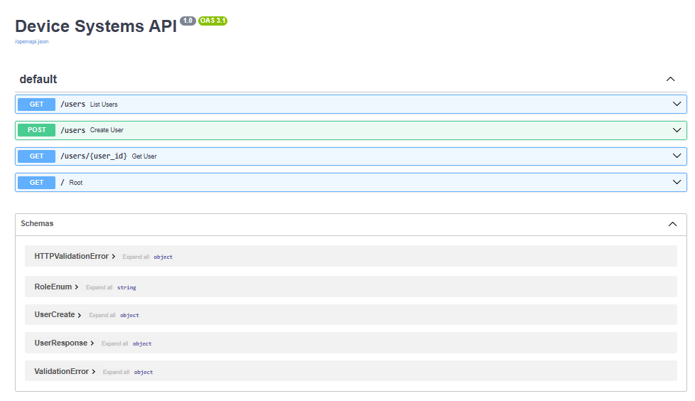

Swagger UI se genera automáticamente. Aquí se ven todos los endpoints disponibles y se pueden probar.

## 2. POST /users – Usuario creado exitosamente (201)

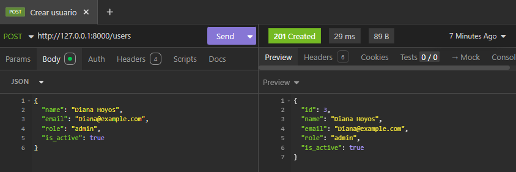

Se envía un usuario con nombre "Diana Hoyos", email válido y rol "admin". FastAPI responde con código 201 y devuelve el usuario creado con un ID asignado.

## 3. POST /users – Error por nombre muy corto (422)
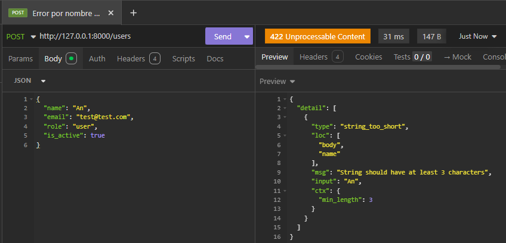

Se intenta crear un usuario con nombre "An" (menos de 3 caracteres). La validación falla y FastAPI responde con error 422 indicando que el nombre debe tener al menos 3 caracteres.

## 4. POST /users – Error por email duplicado (400)
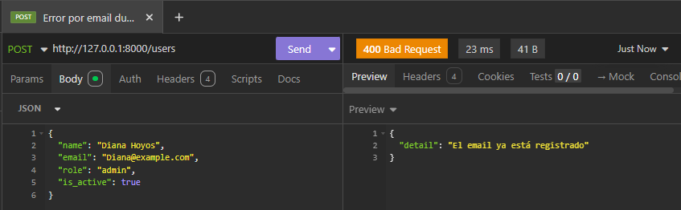

Se envía un email que ya está registrado. La API detecta la duplicidad y responde con código 400 y un mensaje claro.

## 5. POST /users – Error por rol inválido (422)
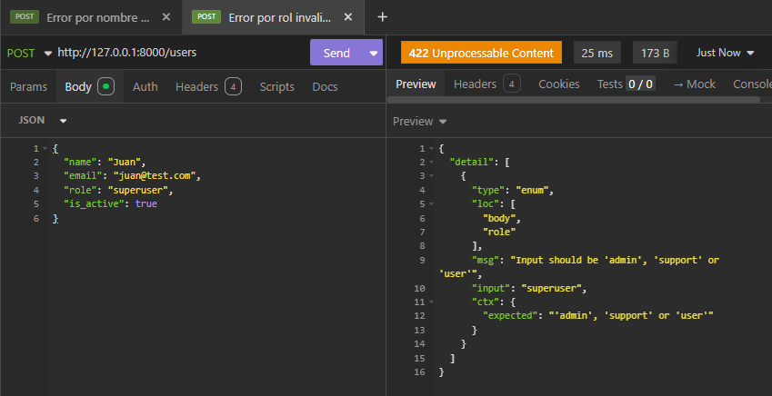

Se envía el rol "superuser" que no está permitido. Solo se aceptan "admin", "support" o "user". El error 422 especifica el problema.

## 6. POST /users – Error por email mal formado (422)
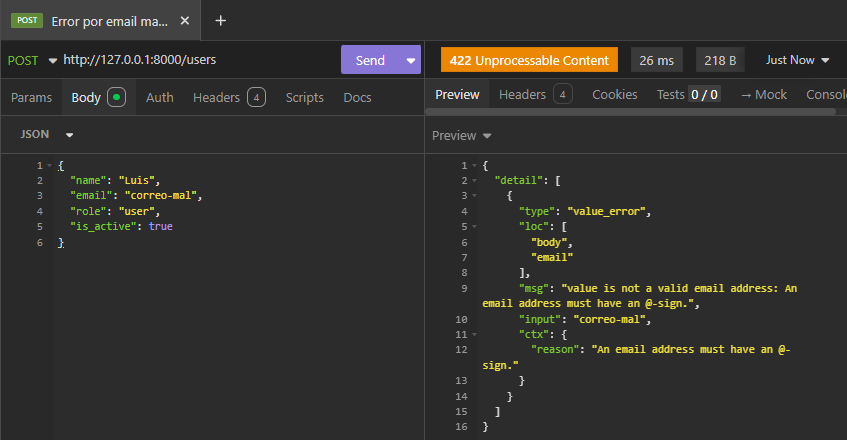

Se envía un email sin "@". La validación de Pydantic lo rechaza y devuelve un error explicativo.

## 7. GET /users – Listar todos los usuarios
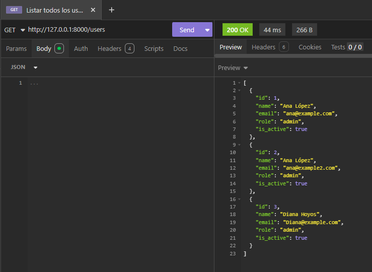

Se obtienen todos los usuarios registrados hasta el momento. La respuesta es un arreglo JSON con cada usuario.

## 8. GET /users?role=admin – Filtrar por rol
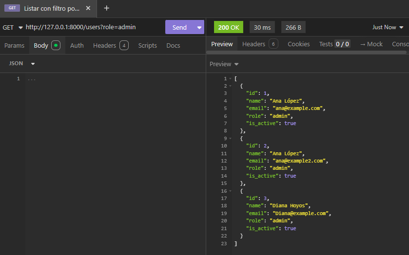

Se consulta la lista de usuarios filtrando por rol "admin". Solo aparecen los usuarios que tienen ese rol.

## 9. GET /users?is_active=false – Filtrar inactivos
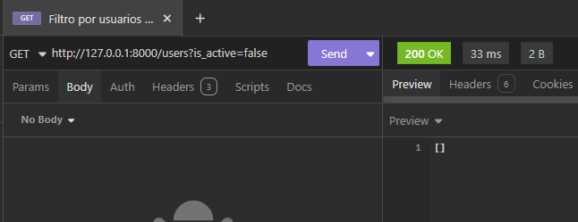

Se filtran los usuarios que están inactivos. En este caso no hay ninguno, por lo que la respuesta es un arreglo vacío.

## 10. GET /users/3 – Usuario existente
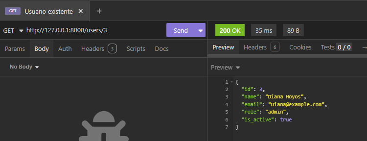

Se consulta un usuario por su ID (3). Como existe, la API responde con código 200 y sus datos.

## 11. GET /users/100 – Usuario no encontrado (404)
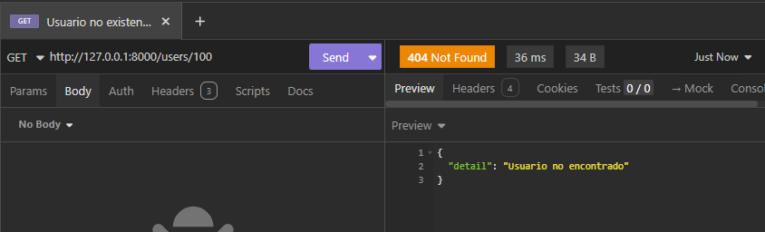

Se pide un ID que no corresponde a ningún usuario. La API responde con 404 y el mensaje "Usuario no encontrado".

## 12. Cabeceras personalizadas
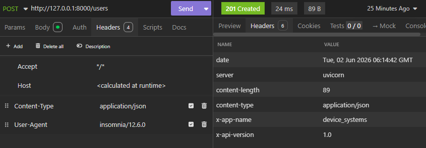

En todas las respuestas se incluyen las cabeceras X-App-Name: device_systems y X-API-Version: 1.0. En la captura se ven dentro de Insomnia.

# Reflexión sobre FastAPI
FastAPI me pareció muy fácil de usar. Con solo escribir los modelos de Pydantic ya obtienes validación y documentación automática. No tuve que escribir mucho código repetitivo. Los errores de validación (422) son claros y ayudan a saber qué está mal.

La parte de cabeceras personalizadas y parámetros de consulta (?role=admin) es muy directa. También me gustó que puedas ocultar datos sensibles con response_model.

El único problema fue acordarme de instalar email-validator y de poner las rutas fijas antes de las dinámicas para que no se confundan.

En general, FastAPI es ideal para hacer APIs rápidas, limpias y con buen rendimiento. Lo recomiendo para proyectos pequeños y grandes.

# GA1-220501096-01-AA1-EV08 – FastAPI Intermedio: Evolución de device_systems con CRUD Completo, Manejo de Errores, Swagger/OpenAPI y Dependency Injection

**Link de Youtube:** https://youtu.be/0-p2MIG4v4M

# Introducción

En esta actividad evolucioné la API device_systems que había construido en la actividad anterior. Partí del proyecto base que ya tenía endpoints GET y POST, y lo convertí en una API REST completa con operaciones de actualización y eliminación.

Ahora el recurso users permite:

- Crear usuarios (POST).

- Listar y consultar por ID (GET).

- Actualizar completamente un usuario (PUT).

- Actualizar parcialmente (PATCH), por ejemplo, cambiar solo el rol o el email.

- Eliminar usuarios (DELETE).

Además, organicé el código separando responsabilidades en carpetas: routes, schemas, services, dependencies y data. Esto hizo el proyecto más limpio y fácil de mantener.

Implementé inyección de dependencias con Depends() para reutilizar la validación de existencia de usuarios. También mejoré el manejo de errores usando HTTPException con códigos HTTP adecuados (200, 201, 204, 400, 404, 422).

## Estructura del proyecto

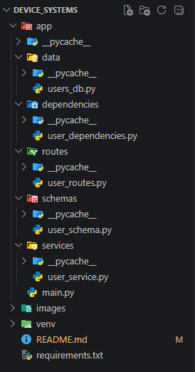

# Manejo de errores con HTTPException
- Se utilizaron códigos de estado HTTP apropiados y mensajes claros:

- 404 Not Found – cuando el recurso no existe.

- 400 Bad Request – email duplicado, PATCH sin campos, datos incorrectos.

- 422 Unprocessable Entity – errores de validación de Pydantic (nombre corto, email mal formado, rol no permitido).

- 201 Created – éxito al crear.

- 204 No Content – éxito al eliminar.

- 200 OK – éxito en consultas y actualizaciones.
--- 
# Dependency Injection

Se implementó una dependencia reutilizable en dependencies/user_dependencies.py para evitar duplicar la lógica de búsqueda de usuario y manejo de errores 404.

```python
# app/dependencies/user_dependencies.py
from fastapi import Depends, HTTPException, status
from app.services.user_service import get_user_by_id

def get_user_or_404(user_id: int):
    user = get_user_by_id(user_id)
    if not user:
        raise HTTPException(
            status_code=status.HTTP_404_NOT_FOUND,
            detail="Usuario no encontrado"
        )
    return user
```
Esta dependencia se inyecta en las rutas que necesitan un usuario existente:

```python
# app/routes/user_routes.py
from app.dependencies.user_dependencies import get_user_or_404

@router.get("/users/{user_id}", response_model=UserResponse)
def get_user(user: dict = Depends(get_user_or_404)):
    return user

@router.put("/users/{user_id}", response_model=UserResponse)
def update_complete_user(user_id: int, user_data: UserCreate, user_exist: dict = Depends(get_user_or_404)):
    return update_user_complete(user_id, user_data)
```
Ventajas: centraliza la validación de existencia, reduce código repetido y mejora la mantenibilidad.


---

# Evidencias de pruebas

## Swagger UI – Documentación interactiva

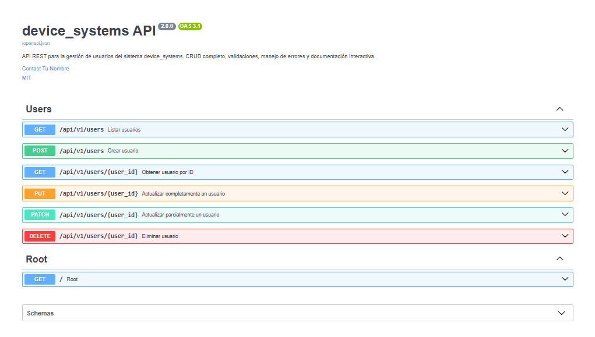
---

## Pruebas con PUT

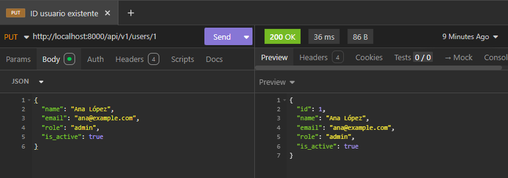

Se realizó una petición PUT a http://localhost:8000/api/v1/users/1 enviando todos los campos del usuario (name, email, role, is_active). El usuario con ID 1 existía previamente, por lo que la API lo actualizó correctamente.

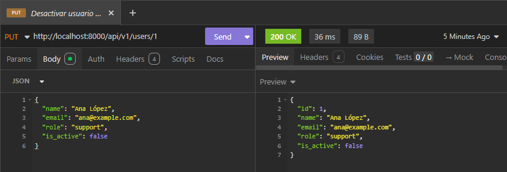

Se envió una petición PUT a http://localhost:8000/api/v1/users/1 con los campos actualizados: role cambió a "support" y is_active a false. La API reemplazó completamente los datos del usuario existente y devolvió el objeto actualizado.

Código HTTP: 200 OK


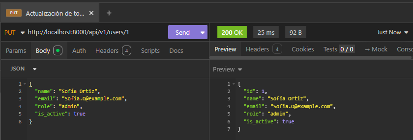

Se realizó una petición PUT a http://localhost:8000/api/v1/users/1 enviando todos los campos del usuario con nuevos valores: name = "Sofia Ortiz", email = "Sofia.O@example.com", role = "admin", is_active = true. El usuario existente fue reemplazado completamente y la API respondió con el objeto actualizado.

Código HTTP: 200 OK

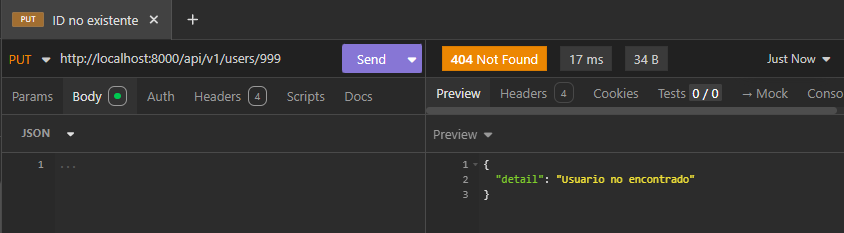

Se intentó actualizar un usuario con ID 999 que no existe en la base de datos. La API validó el ID y respondió con un error indicando que el recurso no fue encontrado.

Código HTTP: 404 Not Found

## Pruebas con PATCH

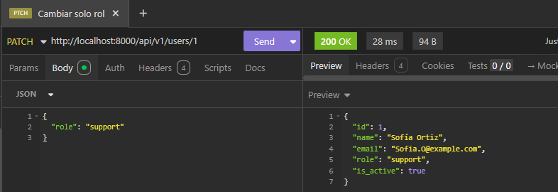

Se envió una petición PATCH a http://localhost:8000/api/v1/users/1 con el cuerpo {"role": "support"}, actualizando únicamente el campo role del usuario. Los demás campos (nombre, email, estado activo) permanecieron sin cambios. La API aplicó la actualización parcial y devolvió el objeto completo del usuario modificado.

Código HTTP: 200 OK

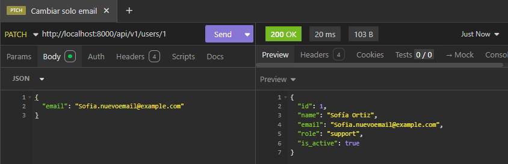

Se realizó una petición PATCH a http://localhost:8000/api/v1/users/1 con el cuerpo {"email": "sofia.nuevoemail@example.com"}, actualizando únicamente el campo email del usuario. La API aplicó la actualización parcial y devolvió el objeto completo del usuario modificado, conservando el resto de campos sin cambios.

Código HTTP: 200 OK

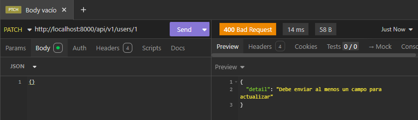

Se intentó realizar una actualización parcial enviando una petición PATCH a http://localhost:8000/api/v1/users/1 con un cuerpo JSON vacío ({}), es decir, sin ningún campo a modificar. La API detectó que no se proporcionó ningún dato válido para actualizar y rechazó la operación.

Código HTTP: 400 Bad Request

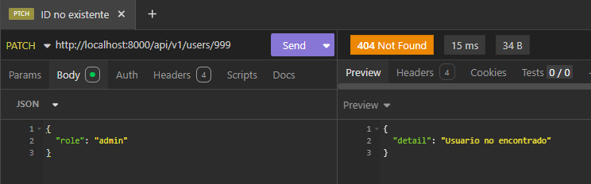

Se intentó actualizar parcialmente un usuario con ID 999, el cual no existe en la base de datos. La API validó el ID y respondió con un error indicando que el recurso no fue encontrado, sin modificar ningún dato.

Código HTTP: 404 Not Found

## Pruebas con DELETE

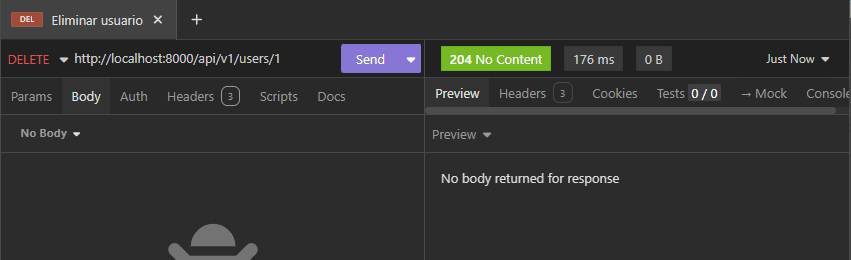

Se envió una petición DELETE a http://localhost:8000/api/v1/users/1 para eliminar al usuario con ID=1, el cual existía en la base de datos. La API procesó la eliminación correctamente y, al no retornar contenido en el cuerpo de la respuesta, utilizó el código de estado 204 No Content, indicando que la operación fue exitosa pero sin datos adicionales.

Código HTTP: 204 No Content

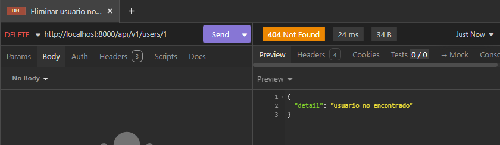

Se envió una petición DELETE a http://localhost:8000/api/v1/users/1 intentando eliminar un usuario con ID=1 que ya había sido eliminado previamente o no existía en la base de datos. La API validó el ID y respondió con un error indicando que el recurso no fue encontrado.

Código HTTP: 404 Not Found

---
##  Tabla de endpoints (CRUD completo)

| Método | Ruta | Descripción | Códigos de estado |
|--------|------|-------------|-------------------|
| GET | `/api/v1/users` | Listar todos los usuarios (con filtros opcionales `?role`, `?is_active`) | 200 OK |
| GET | `/api/v1/users/{user_id}` | Obtener un usuario por su ID | 200 OK, 404 Not Found |
| POST | `/api/v1/users` | Crear un nuevo usuario | 201 Created, 400 Bad Request (email duplicado), 422 Unprocessable Entity |
| PUT | `/api/v1/users/{user_id}` | Actualizar completamente un usuario (todos los campos) | 200 OK, 404 Not Found, 400 Bad Request |
| PATCH | `/api/v1/users/{user_id}` | Actualizar parcialmente un usuario (solo campos enviados) | 200 OK, 404 Not Found, 400 Bad Request (body vacío) |
| DELETE | `/api/v1/users/{user_id}` | Eliminar un usuario | 204 No Content, 404 Not Found |

---
# GA1-220501096-01-AA1-EV09 – FastAPI con SQLAlchemy: Persistencia de Datos y CRUD sobre Base de Datos en device_systems

**Link video de YouTube:** https://youtu.be/OV3HhpEqdlk

En esta actividad evolucioné la API device_systems para que los usuarios ya no se guarden en la memoria del servidor (como en la actividad 8), sino en una base de datos real SQLite usando SQLAlchemy. Ahora, si apago y vuelvo a prender el servidor, los usuarios siguen ahí. También aprendí a separar los modelos de base de datos (SQLAlchemy) de los esquemas de validación (Pydantic), y a usar la inyección de dependencias con Depends(get_db) para manejar las sesiones de forma limpia. Al final, la API quedó más robusta, con persistencia real y preparada para crecer.

## Estructura del proyecto

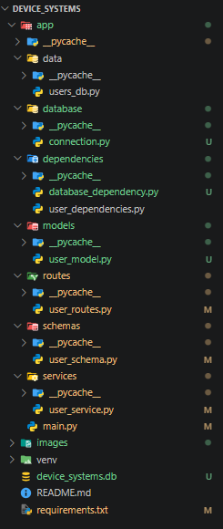

## Base de datos generada

La API usa SQLite como motor de base de datos. Al ejecutar el servidor por primera vez, se crea automáticamente el archivo device_systems.db en la raíz del proyecto.


## Documentación Automática Swagger UI

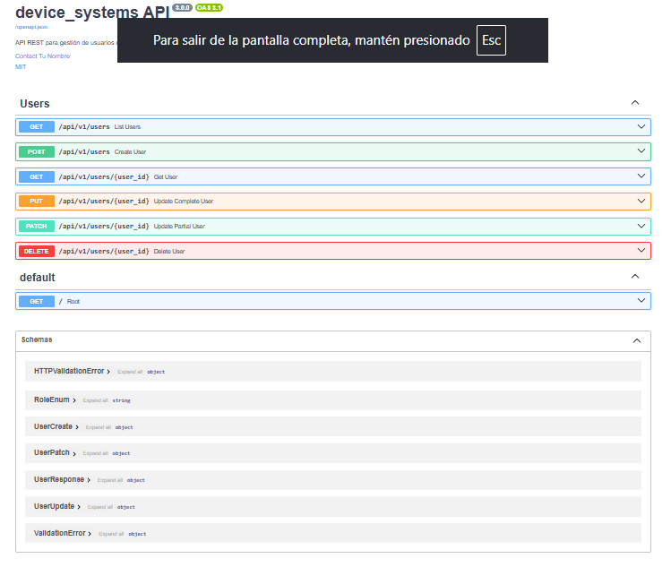


# Configuración de base de datos con SQLAlchemy
Archivo app/database/connection.py – Configura el motor y la sesión:

```python
from sqlalchemy import create_engine
from sqlalchemy.orm import sessionmaker
from sqlalchemy.ext.declarative import declarative_base

DATABASE_URL = "sqlite:///./device_systems.db"

engine = create_engine(DATABASE_URL, connect_args={"check_same_thread": False})
SessionLocal = sessionmaker(autocommit=False, autoflush=False, bind=engine)
Base = declarative_base()

def create_tables():
    Base.metadata.create_all(bind=engine)
```

Modelo User (app/models/user_model.py):

```python
class User(Base):
    __tablename__ = "users"
    id = Column(Integer, primary_key=True, index=True)
    name = Column(String(100), nullable=False)
    email = Column(String(255), nullable=False, unique=True, index=True)
    role = Column(String(20), nullable=False)
    is_active = Column(Boolean, nullable=False, default=True)
    created_at = Column(DateTime, default=datetime.utcnow)
```
Inyección de dependencia (app/dependencies/database_dependency.py):

```python
def get_db():
    db = SessionLocal()
    try:
        yield db
    finally:
        db.close()
Cada endpoint recibe la sesión mediante Depends(get_db).
```

---
# Tabla de endpoints (CRUD completo)

| Método | Ruta | Descripción | Códigos de estado |
|--------|------|-------------|-------------------|
| GET | `/api/v1/users` | Listar todos (con filtros opcionales `?role`, `?is_active`) | 200 OK |
| GET | `/api/v1/users/{id}` | Obtener usuario por ID | 200 OK, 404 Not Found |
| POST | `/api/v1/users` | Crear usuario | 201 Created, 400 Bad Request (email duplicado), 422 Unprocessable Entity |
| PUT | `/api/v1/users/{id}` | Actualizar completamente | 200 OK, 404 Not Found, 400 Bad Request |
| PATCH | `/api/v1/users/{id}` | Actualizar parcialmente | 200 OK, 404 Not Found, 400 Bad Request (body vacío) |
| DELETE | `/api/v1/users/{id}` | Eliminar usuario | 204 No Content, 404 Not Found |

---

# Evidencias de pruebas por endpoint

## Pruebas exitosas

### POST – Crear usuario válido (201)
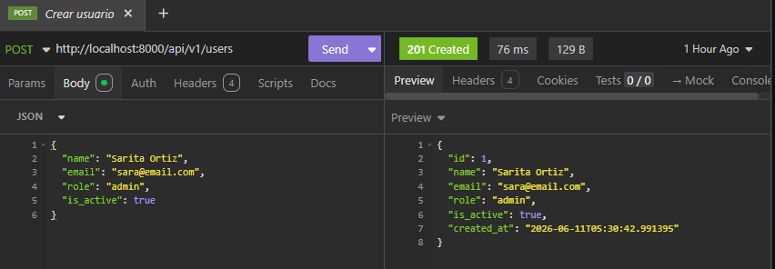

### GET – Listar todos los usuarios (200)
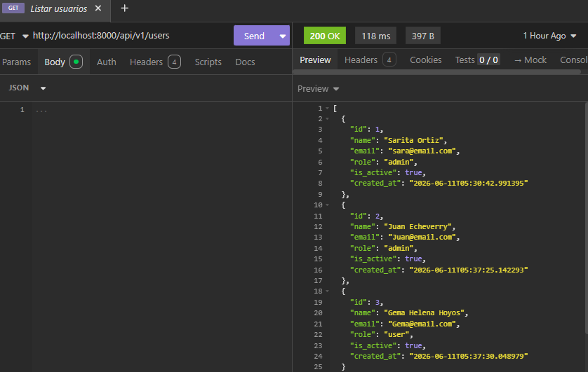

### GET – Usuario por ID existente (200)
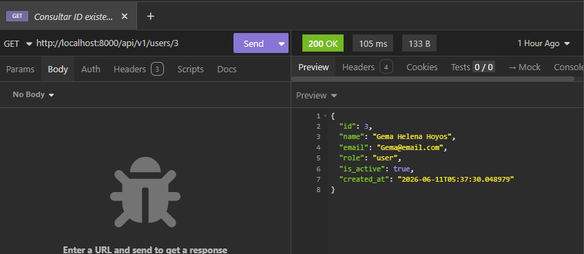

### PUT – Actualizar completo (200)
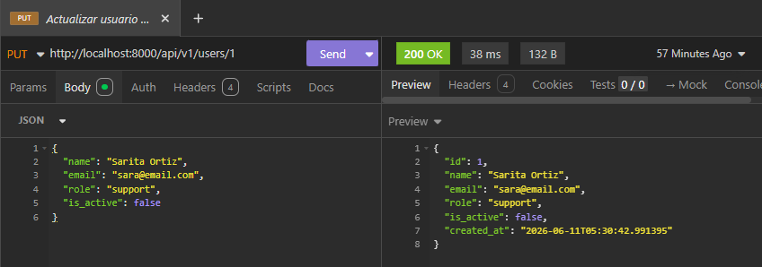

### PATCH – Actualizar parcial (cambiar rol) (200)
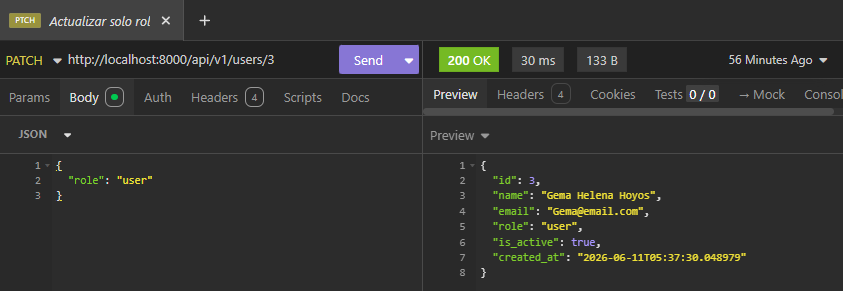

### DELETE – Eliminar usuario existente (204)
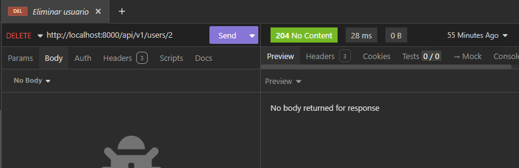

### GET – Filtrar por rol (?role=admin) (200)
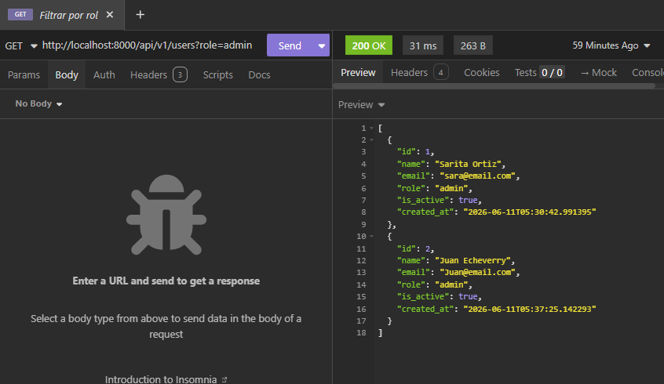

### GET – Filtrar por activos (?is_active=true) (200)
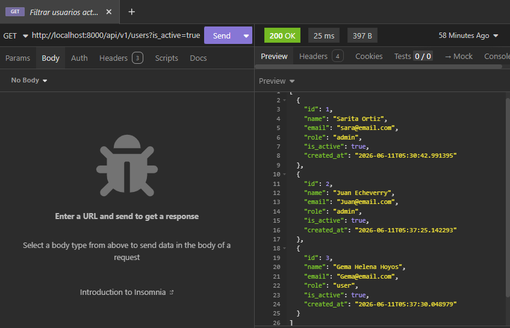


## Manejo de errores

### POST – Email duplicado	400 Bad Request
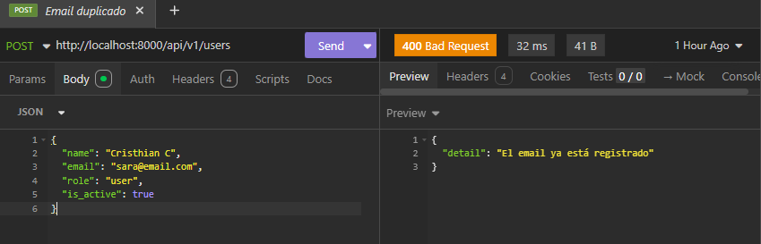

### POST – Nombre muy corto (validación)	422 Unprocessable Entity
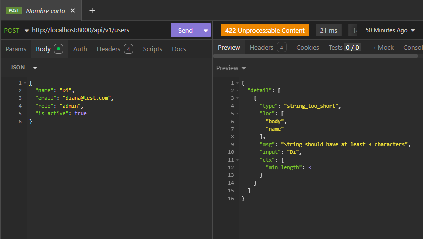

### POST – Rol no permitido	422 Unprocessable Entity
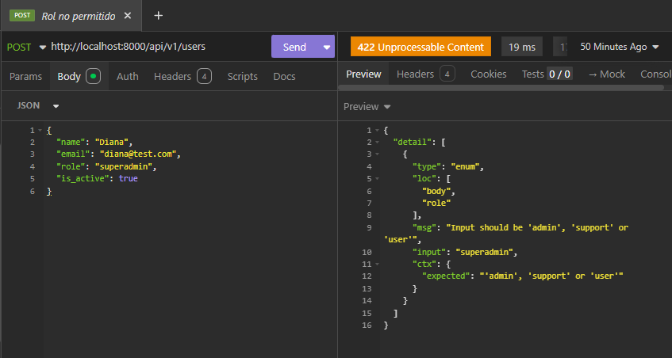

### GET – ID inexistente	404 Not Found
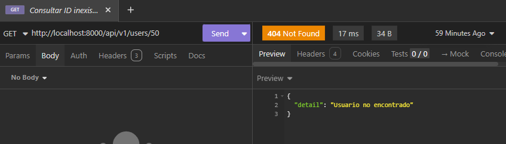

### PATCH – Usuario no encontrado	404 Not Found
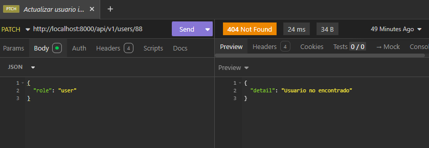


### DELETE – Usuario inexistente	404 Not Found
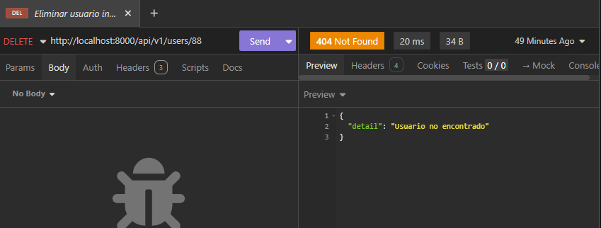

### GET – Validar que ya no existe (después de DELETE)	404 Not Found
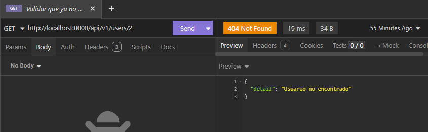


## Manejo de errores y códigos de estado

La API utiliza códigos HTTP estándar para comunicar el resultado de cada operación:

| Código | Significado | Cuándo ocurre |
|--------|-------------|----------------|
| 200 OK | Éxito | GET, PUT, PATCH exitosos |
| 201 Created | Recurso creado | POST /users válido |
| 204 No Content | Eliminación exitosa | DELETE /users/{id} (sin cuerpo) |
| 400 Bad Request | Error del cliente | Email duplicado, PATCH sin campos |
| 404 Not Found | Recurso no existe | GET/PUT/PATCH/DELETE con ID inexistente |
| 422 Unprocessable Entity | Validación fallida | Nombre corto, rol inválido, email mal formado |

---
## Dependency Injection con SQLAlchemy
Se implementó una dependencia reutilizable para la sesión de base de datos:

```python
# app/dependencies/database_dependency.py
def get_db():
    db = SessionLocal()
    try:
        yield db
    finally:
        db.close()
```
Esta dependencia se inyecta en los endpoints usando Depends(get_db), garantizando que cada petición HTTP tenga su propia sesión y que se cierre automáticamente al finalizar.

Ejemplo en ruta:

```python
@router.get("/users/{user_id}", response_model=UserResponse)
def get_user(user_id: int, db: Session = Depends(get_db)):
    return user_service.get_user_or_404(db, user_id)
```
---
# Reflexión final sobre la evolución del proyecto

Al inicio, device_systems guardaba los usuarios en una simple lista en memoria. Servía para aprender, pero tenía una gran limitación: al reiniciar el servidor, todos los datos desaparecían. No era una API útil en el mundo real.

La evolución más importante fue incorporar persistencia real con SQLAlchemy y SQLite. Ahora los usuarios se almacenan en una base de datos y sobreviven a los reinicios. Esto me hizo entender por qué las aplicaciones profesionales necesitan una base de datos.

También aprendí a separar responsabilidades: los modelos SQLAlchemy definen cómo se guardan los datos (tipos, restricciones como nullable y unique), mientras que los esquemas Pydantic definen cómo se validan y se muestran en la API. Esta separación mantiene el código limpio y seguro.

Otro avance fue usar inyección de dependencias con Depends(get_db). Cada petición HTTP recibe su propia sesión de base de datos y se cierra automáticamente. Esto evita errores de conexión y hace el código más reutilizable.

El manejo de errores también mejoró: ahora la API responde con códigos HTTP claros (200, 201, 204, 400, 404, 422) y mensajes descriptivos. El cliente siempre sabe qué pasó: si el email está duplicado, si el ID no existe o si los datos no son válidos.

# [Proyecto-Final-v1] GA1-220501096-01-AA1-EV10 – FastAPI Avanzado: Migraciones con Alembic, Asociaciones de Modelos y Consultas con Joins en device_systems

**Link video de Youtube:** https://youtu.be/W525i0fvi-Y

API REST para gestión de usuarios, dispositivos y préstamos con relaciones entre modelos, migraciones controladas con Alembic y consultas avanzadas con joins.

## Tecnologías utilizadas

- FastAPI
- SQLAlchemy (ORM)
- Alembic (migraciones)
- SQLite
- Pydantic
- Uvicorn

## Estructura del proyecto

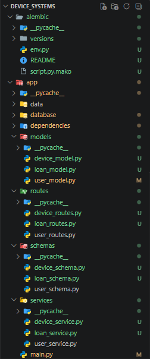

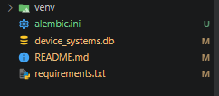

## Configuración de Alembic

### 1. Instalación de Alembic

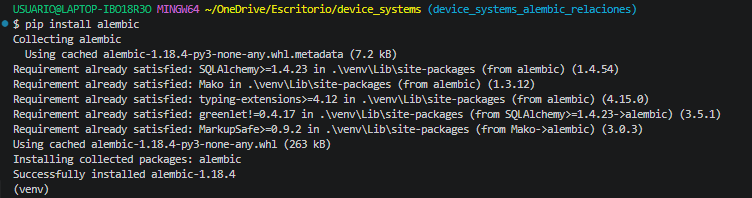

### 2. Inicializar Alembic

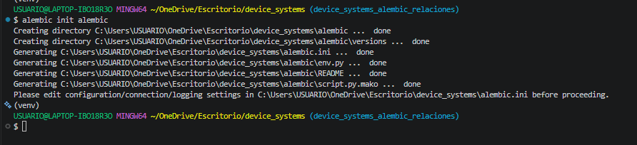

Ejecución del comando alembic init alembic que crea la estructura inicial de migraciones.

### 3. Generar migración automática

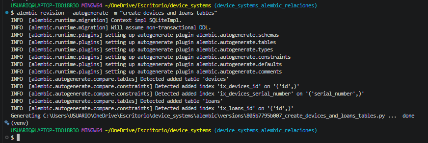

Generación de la migración que detecta automáticamente los nuevos modelos Device y Loan.

### 4. Aplicar migración a la base de datos

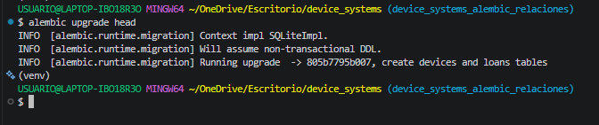

Aplicación de la migración a la base de datos, creando las tablas devices, loans y actualizando alembic_version.

### 5. Ver historial de migraciones

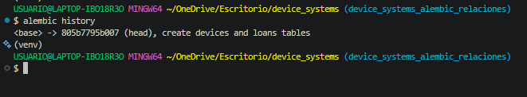

Listado de todas las migraciones aplicadas, mostrando la revisión actual y el historial completo.

## Estructura de la base de datos (tablas generadas)

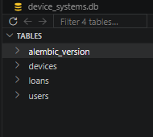

Vista de las tablas creadas en la base de datos: users (existente), devices, loans y alembic_version (control de migraciones).

## Documentación Swagger UI

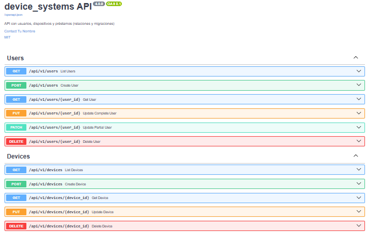


Documentación interactiva generada por FastAPI, organizada por tags: Users, Devices y Loans. Muestra los esquemas de entrada y salida, y permite probar los endpoints directamente.

# Evidencias de pruebas funcionales

## Creación de usuario, dispositivos y préstamos

### Creación de usuario


### Crear dispositivo válido


Envío de datos correctos a POST /devices. Respuesta 201 Created con el dispositivo creado y su ID asignado.

### Creación de un prestamo exitoso


Asignación de un dispositivo disponible a un usuario. Respuesta 201 Created con el préstamo activo.

### Prestar dispositivo no disponible


Intento de prestar un dispositivo ya prestado. La API responde con 409 Conflict y el mensaje "Dispositivo no disponible".

### Devolver dispositivo


Devolución de un préstamo activo. La API actualiza el estado a "returned", asigna fecha de devolución y libera el dispositivo. Respuesta 200 OK.

## Consultas con joins y filtros

### GET /loans/details (sin filtros)


Consulta de todos los préstamos con información relacionada del usuario y del dispositivo. Respuesta 200 OK con datos enriquecidos.

### Filtrar por status=active


Filtro por estado activo. La API devuelve solo los préstamos con status = "active".

### Filtrar por device_type=tablet


Filtro por tipo de dispositivo. La consulta usa join con la tabla devices para devolver solo préstamos de tablets.

### Préstamos de un usuario específico


### Consultar préstamo (con filtros)


### Historial de préstamos de un dispositivo


Consulta de todos los préstamos registrados para un dispositivo específico. Útil para saber el historial de uso del equipo.

## Manejo de errores y códigos de estado

| Código | Significado | Cuándo ocurre |
|--------|-------------|----------------|
| 201 Created | Recurso creado | POST /devices, POST /loans |
| 200 OK | Éxito | GET, PUT, PATCH exitosos |
| 204 No Content | Eliminación exitosa | DELETE /devices/{id} |
| 400 Bad Request | Error de cliente | Serial duplicado, datos inválidos |
| 404 Not Found | Recurso no existe | Dispositivo, usuario o préstamo no encontrado |
| 409 Conflict | Conflicto de regla de negocio | Dispositivo no disponible, préstamo ya devuelto |
| 422 Unprocessable Entity | Validación fallida | Datos con formato incorrecto |

## Reflexión sobre la importancia de migraciones, relaciones y consultas avanzadas

**Sobre migraciones con Alembic:**

Alembic me permitió versionar los cambios en la base de datos de forma controlada y profesional. Generar una migración automática con --autogenerate y aplicarla con upgrade head fue sencillo y seguro, evitando errores manuales al modificar la estructura de las tablas. Poder revertir cambios con downgrade y mantener un historial claro con alembic history da tranquilidad al trabajar en equipo y en entornos de producción, donde los cambios deben ser trazables y reversibles.

**Sobre relaciones entre modelos:**

Definir ForeignKey y relationship con back_populates permitió acceder a datos relacionados de forma natural y eficiente. Por ejemplo, desde un préstamo puedo obtener el usuario y el dispositivo sin escribir joins manuales ni consultas SQL complejas. Esto simplifica el código, lo hace más legible y reduce errores. Las relaciones también garantizan la integridad referencial: no se puede crear un préstamo sin un usuario o dispositivo existente, lo que protege la calidad de los datos.

**Sobre consultas avanzadas con joins y filtros:**

Implementar GET /loans/details con filtros dinámicos (status, user_email, device_type) mostró la potencia de SQLAlchemy para construir consultas flexibles y eficientes. La combinación de join(), filter() y ilike() permite búsquedas precisas combinando información de múltiples tablas en una sola consulta. Esto evita hacer múltiples peticiones a la base de datos y mejora el rendimiento de la API.

**Conclusión general:**

Esta actividad me enseñó a diseñar un sistema con múltiples tablas relacionadas, gestionar migraciones profesionales y construir endpoints que devuelven información enriquecida. La API device_systems ahora es más robusta, escalable y lista para un entorno real. Alembic, SQLAlchemy y FastAPI trabajan juntos para crear un backend sólido y mantenible.

# [Proyecto-Final-v2] GA1-220501096-01-AA1-EV11 – FastAPI Seguridad: Autenticación, Middleware, CORS, Rate Limiting y Validación Avanzada en device_systems

**Link video de Youtube:** https://youtu.be/0FHKPUPGjKg

API REST segura para gestión de usuarios, dispositivos y préstamos con autenticación JWT, middleware, CORS, rate limiting y validaciones avanzadas con Pydantic v2.

## Tecnologías utilizadas

- FastAPI
- SQLAlchemy
- Alembic
- Pydantic v2
- Passlib (bcrypt)
- Python-JOSE (JWT)
- SlowAPI (rate limiting)
- SQLite
- Uvicorn

## Estructura del proyecto


## Migración Alembic aplicada

Se generó y aplicó una migración para agregar los campos de autenticación al modelo `User`.


## Pruebas de autenticacion

### 1. Registro de usuario exitoso (201 Created)


POST /auth/register con datos válidos. Respuesta 201 Created con el usuario creado.

### 2. Registro con contraseña débil (422 Unprocessable Entity)


POST /auth/register con contraseña de menos de 8 caracteres. Respuesta 422 con detalle de validación.

### 3. Registro con email duplicado (400 Bad Request)


POST /auth/register con un email ya registrado. Respuesta 400 Bad Request.

### 4. Login correcto (200 OK con token)


POST /auth/login con credenciales válidas. Respuesta 200 OK con access_token.

### 5. Login con contraseña incorrecta (401 Unauthorized)


POST /auth/login con contraseña incorrecta. Respuesta 401 Unauthorized.

### 6. Consulta de /auth/me con token válido (200 OK)


GET /auth/me con token válido en el header Authorization. Respuesta 200 OK con los datos del usuario.

### 7. Acceso a ruta protegida sin token (401 Unauthorized)


GET /users sin token de autenticación. Respuesta 401 Unauthorized.

### 8. Acceso con token inválido (401 Unauthorized)


GET /auth/me con un token falso. Respuesta 401 Unauthorized.

### 9. Acceso con usuario sin permisos (403 Forbidden)


### 10. Login correcto (200 OK con token)


###  Creación de dispositivo con rol admin (201 Created)


## Middleware y CORS

### Cabeceras generadas por middleware


Todas las respuestas incluyen las cabeceras X-App-Name, X-Request-ID y X-Process-Time, generadas por el middleware personalizado.

### Configuración CORS

Se configuró CORS en app/main.py permitiendo los orígenes locales para desarrollo:


En producción no se recomienda usar allow_origins=["*"] con allow_credentials=True porque permitiría que cualquier dominio acceda a recursos con credenciales (cookies, tokens), lo cual es un riesgo de seguridad. Es mejor especificar los dominios autorizados.

###  Rate limiting

Activación de rate limiting (429 Too Many Requests)


# Documentación Swagger/OpenAPI con OAuth2


Swagger UI (/docs) muestra correctamente:

- Tags: Auth, Users, Devices, Loans

- Endpoints protegidos con candado 🔒

- Botón Authorize para autenticación OAuth2

- Schemas de autenticación (UserRegister, UserLogin, Token)
--- 
# Reflexión final sobre la importancia de la seguridad en APIs REST
La seguridad en una API no es un "extra", sino una necesidad fundamental en cualquier aplicación que maneje datos reales. A lo largo de esta actividad, implementé varias capas de protección que convierten device_systems en un sistema robusto y confiable:

**Autenticación y autorización:**
El uso de OAuth2 con JWT permite que los usuarios se autentiquen de forma segura y que cada petición lleve un token firmado. Los roles (admin, support, user) permiten restringir operaciones según el nivel de permiso, evitando que usuarios no autorizados realicen acciones críticas como eliminar dispositivos.

**Hash de contraseñas:**
Con Passlib y bcrypt, las contraseñas nunca se almacenan en texto plano. Incluso si la base de datos es comprometida, las contraseñas no son legibles. Esta es una práctica obligatoria en cualquier sistema moderno.

**Middleware personalizado:**
Agregar cabeceras como X-Request-ID y X-Process-Time facilita la trazabilidad y el monitoreo. Registrar el tiempo de respuesta y el método de cada petición ayuda a detectar cuellos de botella y a depurar errores en producción.

**CORS:**
Configurar correctamente los orígenes permitidos evita que sitios maliciosos accedan a la API desde el frontend, protegiendo los datos de los usuarios.

**Rate limiting:**
Limitar el número de peticiones por minuto previene ataques de fuerza bruta y abuso del sistema. Es una barrera simple pero efectiva contra intentos de adivinación de contraseñas y sobrecarga del servidor.

**Validaciones avanzadas con Pydantic v2:**
Las validaciones de contraseña (mínimo 8 caracteres, mayúscula, minúscula, número, sin espacios) aseguran que los usuarios elijan credenciales seguras desde el registro.

**Conclusión:**
Una API sin seguridad es una puerta abierta a ataques. Implementar autenticación, autorización, hash, CORS, rate limiting y middleware no solo protege los datos, sino que genera confianza en los usuarios y en los equipos que consumen la API. device_systems pasó de ser un CRUD básico a un sistema preparado para entornos reales, donde la seguridad es el pilar más importante.
